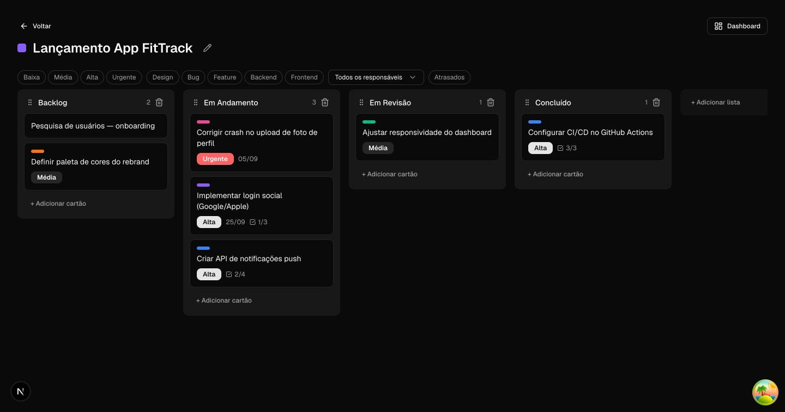
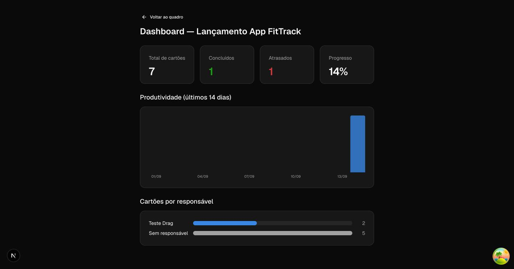
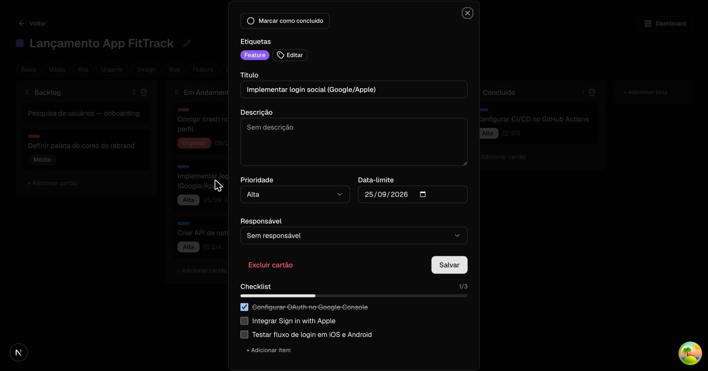
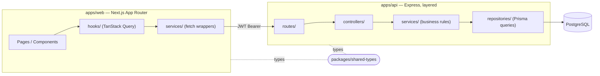

<div align="center">

# 🗂️ Kanbix

**A full-stack project management platform inspired by Trello, Jira and ClickUp — built from scratch to master production-grade full-stack engineering.**

[](https://kanbix-web.vercel.app)
[](../../actions)
[](#license)

[Live App](https://kanbix-web.vercel.app) · [API Health](https://kanbix-api.onrender.com/health) · [Report a bug](../../issues)

</div>

<br />

<div align="center">
  
</div>

<br />

## About

Kanbix is a **Kanban-style project management app** — think Trello crossed with Jira's structure and ClickUp's dashboards. It was built as a portfolio centerpiece to demonstrate professional full-stack engineering: layered backend architecture, a fully-tested React/Next.js frontend, Docker, CI/CD, and real cloud deployment — not a tutorial clone, but a product shaped by real technical decisions, trade-offs, and (documented) bugs found and fixed along the way.

> Built iteratively, one small reviewed step at a time, working through every architectural decision, test, and trade-off before writing code — the way a team actually ships software.

<table>
<tr>
<td width="50%" valign="top">


<p align="center"><sub>Per-board dashboard: completion rate, overdue cards, 14-day productivity chart, workload by assignee</sub></p>

</td>
<td width="50%" valign="top">


<p align="center"><sub>Card detail as an intercepted parallel route — a real, shareable, deep-linkable URL</sub></p>

</td>
</tr>
</table>

## Table of contents

- [Features](#features)
- [Tech stack](#tech-stack)
- [Architecture](#architecture)
- [Testing](#testing)
- [Getting started](#getting-started)
- [Project structure](#project-structure)
- [Deployment](#deployment)
- [Engineering highlights](#engineering-highlights)
- [What's out of scope](#whats-out-of-scope)
- [License](#license)

## Features

### Accounts & access
- [x] Register / login (JWT + bcrypt)
- [x] Workspaces with **Owner / Admin / Member** roles
- [x] Invite members by email, change roles, remove members
- [x] Guard rails: a workspace can never end up with zero owners

### Boards, lists & cards
- [x] Full CRUD on workspaces, boards, lists and cards
- [x] Drag-and-drop cards between lists, and drag-to-reorder lists (`dnd-kit`)
- [x] Priority, due date, assignee, colored labels, description
- [x] Per-card checklist with a live progress count
- [x] Card detail as a **real page** *and* an intercepted modal (see [highlights](#engineering-highlights))
- [x] Unsaved-changes guard: closing a card with unsaved edits asks for confirmation

### Insight & organization
- [x] Per-board dashboard — completion rate, overdue count, 14-day productivity chart, cards-by-assignee
- [x] Client-side filters — priority, label, assignee, overdue — layered on top of the board without touching drag-and-drop state
- [x] Dark / light theme, fully responsive down to mobile widths

### Not yet built
See [What's out of scope](#whats-out-of-scope) — comments, attachments, global search, activity history, password reset and avatars were deliberately deprioritized in favor of depth over breadth.

## Tech stack

<table>
<tr><th>Layer</th><th>Stack</th></tr>
<tr><td><strong>Frontend</strong></td><td>


</td></tr>
<tr><td><strong>Backend</strong></td><td>


</td></tr>
<tr><td><strong>Testing</strong></td><td>


</td></tr>
<tr><td><strong>DevOps</strong></td><td>


</td></tr>
</table>

## Architecture

An **npm-workspaces monorepo** — `apps/api`, `apps/web`, and a `packages/shared-types` package so both sides share the exact same TypeScript types for every API entity (no DTOs drifting out of sync).



**Backend** follows a strict **layered architecture** — `routes → controllers → services → repositories` — the same separation of concerns used in production Node services: controllers only translate HTTP ⇄ domain objects, services hold every business rule (role checks, "no board with zero owners", overdue calculation), and repositories are the only layer that talks to Prisma. Zod validates every request body at the edge (`schemas/`).

**Frontend** has no Server Components for data fetching — the JWT lives in `localStorage`, so the client is the only place that can read it, which pushed route protection into a client-side `(protected)` layout instead of Next.js middleware (the real security boundary is still the API rejecting bad tokens). Every feature follows the same pattern: `services/<x>.service.ts` (pure fetch) → `hooks/use-<x>.ts` (TanStack Query) → a page component that renders the four states every network screen actually has — loading skeleton, error + retry, empty, and data.

<details>
<summary><strong>Data model</strong> (Prisma schema, click to expand)</summary>

```
User ─┬─< WorkspaceMember >─┬─ Workspace ─┬─< Board ─┬─< List ─< Card >─┬─< ChecklistItem
      │    (role: Owner/    │             │          │                 │
      │     Admin/Member)   │             │          │                 └─< Label >── Board
      └─────────────────────┘             └──────────┘   (assignee →) User
```

</details>

## Testing

**339 tests**, written alongside every feature — not bolted on at the end.

| Suite | Count | What it covers |
|---|---:|---|
| API unit | 80 | Services (business rules), isolated from the DB with mocked repositories |
| API integration | 114 | Real Postgres, full HTTP round-trip via Supertest — auth, role checks, cascades |
| Web (RTL) | 145 | Every user-facing flow: forms, optimistic updates, drag-and-drop mapping logic, error states |

```bash
npm run test --workspace=apps/api              # unit
npm run test:integration --workspace=apps/api  # needs Postgres — see below
npm run test --workspace=apps/web
```

TDD was used where it genuinely paid off — new API endpoints were written test-first against the intended contract — rather than as a blanket rule for every line of UI code.

## Getting started

**Requirements:** Node 20+, Docker (for Postgres).

```bash
git clone https://github.com/akiratochiro/kanbix.git
cd kanbix
npm install

cp .env.example .env          # DATABASE_URL, JWT_SECRET
docker compose up -d postgres # Postgres on :5434

npm run prisma:migrate --workspace=apps/api

npm run dev:api   # http://localhost:3333
npm run dev:web   # http://localhost:3001
```

Want everything containerized instead (API + web + Postgres, no local Node needed for running it)?

```bash
docker compose --profile full up --build
```

## Project structure

```
kanbix/
├── apps/
│   ├── api/                 # Express + Prisma, layered architecture
│   │   └── src/
│   │       ├── controllers/ # HTTP ⇄ domain translation
│   │       ├── services/    # business rules
│   │       ├── repositories/# Prisma queries — the only DB-aware layer
│   │       ├── middlewares/ # auth, role guards, error handler
│   │       ├── routes/      # Express routers
│   │       ├── schemas/     # Zod request validation
│   │       └── tests/       # unit + integration (Jest + Supertest)
│   └── web/                 # Next.js 16 App Router
│       └── src/
│           ├── app/         # routes, incl. (protected) layout guard
│           ├── hooks/       # TanStack Query hooks
│           ├── services/    # fetch wrappers
│           ├── components/  # shadcn/ui (classic new-york style)
│           ├── lib/         # query client, api client, schemas
│           └── tests/       # React Testing Library
├── packages/
│   └── shared-types/        # TypeScript types shared by both apps
├── .github/workflows/ci.yml # 3 parallel jobs: api / web / docker
├── docker-compose.yml        # postgres (default) + api + web (--profile full)
└── render.yaml               # Render Blueprint for the API
```

## Deployment

Three independent services, wired by environment variables — no shared hosting, the way a real product would be split:

```
Browser ──▶ Web (Vercel) ──▶ API (Render, Docker) ──▶ Postgres (Neon)
```

- **[Web](https://kanbix-web.vercel.app)** — Vercel, root directory `apps/web`, `NEXT_PUBLIC_API_URL` baked in at build time.
- **[API](https://kanbix-api.onrender.com/health)** — Render, deployed from `apps/api/Dockerfile` via `render.yaml`; free tier, so it sleeps after ~15 min idle (first request after that takes ~30s to wake up).
- **Database** — Neon serverless Postgres; `prisma migrate deploy` runs automatically on every API boot.

Full runbook, including the CORS chicken-and-egg step, in [`DEPLOY.md`](./DEPLOY.md).

## Engineering highlights

A few decisions worth calling out — the kind of thing that comes up in a technical interview:

- **Card detail as Parallel + Intercepting Routes.** The card modal isn't client-state — it's `@modal/(.)cards/[cardId]/page.tsx`, a real Next.js App Router pattern that gives a shareable, deep-linkable URL (`/boards/:id/cards/:cardId`) while still rendering as a modal on soft navigation, and as a full page on hard refresh or direct link.
- **Client-only auth, deliberately.** The JWT lives in `localStorage`, read through a single `useSyncExternalStore`-backed store — which means no Server Components for data and no `middleware.ts` route protection, since the server can never see the token. Route guarding happens in a client `(protected)` layout instead; the API rejecting an invalid token remains the actual security boundary.
- **A real bug, found and root-caused.** A hard reload on any protected route briefly redirected to `/workspaces` — traced to `getServerSnapshot` in the auth store returning `null` on the very first client render after hydration, racing the redirect effect. Fixed with a second `useSyncExternalStore` hydration flag, no `useEffect` involved.
- **Another one: silent data loss on the card form.** Labels and checklist items save instantly; title/priority/due date/assignee only save on an explicit "Save" click. Closing the card without saving silently discarded those edits. Diagnosed by reproducing it live rather than guessing from the code, then fixed with a dirty-state guard and a confirmation dialog — with regression tests.
- **Optimistic drag-and-drop.** `PATCH /cards/:id/move` is a single transactional reorder query; the frontend updates both source and destination list caches optimistically via TanStack Query, with rollback on failure. The over → (list, index) drop resolution is a pure, unit-tested function, decoupled from the drag interaction itself.
- **Validated, accessible color choices.** The dashboard's stat tiles and category colors don't use shadcn's default chart tokens — those failed a contrast/chroma validation pass — and were replaced with a hand-checked palette instead of shipping first-draft colors.

## What's out of scope

Deliberately deprioritized to keep the project finishable and interview-ready, rather than an ever-growing backlog:

| Feature | Status |
|---|---|
| Comments & attachments on cards | Not started (attachments need Multer wiring, currently unused) |
| Global search | Not started |
| Activity history ("Jane moved a card") | Not started |
| User profile, avatar, password reset | Not started (auth is otherwise functionally complete) |

The original plan intentionally covered more ground than a solo portfolio project needs to prove its point — the features above were cut consciously once the core learning goals (layered architecture, testing discipline, Docker, CI/CD, advanced TypeScript, a deployed product) were already solidly demonstrated.

## License

Personal portfolio project. Feel free to read, fork, or borrow ideas from the code — no formal license is attached.

---

<div align="center">
<sub>Built by Akira Tochiro as a Full Stack portfolio project.</sub>
</div>
